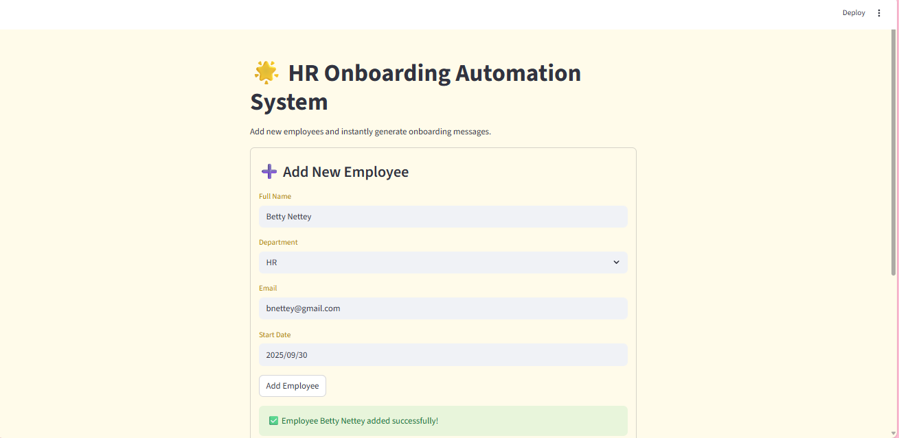
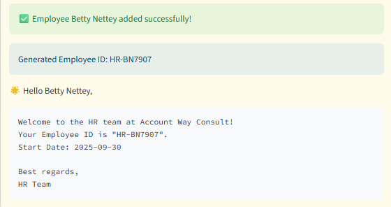

# 👩‍💼 HR Onboarding Automation System

A simple **Streamlit app** that automates the HR onboarding process.  
It generates employee IDs, stores new hire data, and sends a welcome message.

---

## 🖊️ Features
- Add new employees via a form
- Auto-generate unique **Employee IDs** (`DEPT-Initials####`)
- Save records to **Excel** (`new_hires.csv`)
- Generate a **Welcome Message** for each employee

---

## 📸 Screenshots

